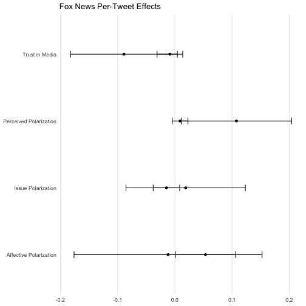

```r
df <- read_tsv(here("scripts/formatted_data.tsv")) #%>% 
```

```
## Warning: Missing column names filled in: 'X1' [1]
```

```
## 
## ── Column specification ──────────────────────────────────────────────────────────────────────────────────────────────────────────────────────────────────────────────────────────────────────────────────────────────────────────────────────────────────
## cols(
##   X1 = col_double(),
##   id = col_double(),
##   author = col_character(),
##   text = col_character(),
##   time = col_double(),
##   blacklist_text = col_logical(),
##   event = col_character(),
##   workerID = col_character(),
##   treatment_group = col_double(),
##   blacklist_author = col_logical()
## )
```

```r
df <- df %>% mutate(
    treatment_group=ifelse(workerID=='A3PRZRK9IC5CBI', 1, treatment_group),
    workerID=ifelse(workerID=='A6Y7SZU9L301W', 'A2D8LB2RPJXMSQ', workerID),
    treatment_group=ifelse(workerID=='A2D8LB2RPJXMSQ', 2, treatment_group),
    workerID=ifelse(workerID=='A2RCYLK072XXO', 'AKSJ3C5O3V9RB', workerID),
    treatment_group=ifelse(workerID=='AKSJ3C5O3V9RB', 1, treatment_group),
    treatment_group=ifelse(workerID=='A3MIDLO5S7FU06', 0, treatment_group),
    treatment_group=ifelse(workerID=='A2Z6NL0CTXY0ZB', 0, treatment_group)
)
```


```r
# i want to know how many tweets each respondent has seen
agg_df <- df %>%
    group_by(workerID, treatment_group, event) %>%
    count()
```

## Basic summary


```r
n_installs <- df %>%
    filter(event == "install") %>%
    select(workerID) %>%
    distinct() %>%
    count()
n_users_active <- df %>%
    filter(event == "show") %>%
    select(workerID) %>%
    distinct() %>%
    count()
rate <- n_users_active / n_installs
```

There have been 82 unique users who installed the extension. Of these, 19 have used twitter since installation. The average active user per install rate is 0.2317073.


## By treatment group

Installs by treatment group

```r
agg_df %>%
    filter(event == "install") %>%
    group_by(treatment_group) %>%
    summarize(total_n = sum(n))
```

```
## # A tibble: 4 x 2
##   treatment_group total_n
##             <dbl>   <int>
## 1               0      30
## 2               1      34
## 3               2      29
## 4              NA       3
```

Tweets seen by treatment group

```r
agg_df %>%
    filter(event == "show") %>%
    group_by(treatment_group) %>%
    summarize(total_n = sum(n))
```

```
## # A tibble: 3 x 2
##   treatment_group total_n
##             <dbl>   <int>
## 1               0   13927
## 2               1    4004
## 3               2    1686
```


Users who have seen any tweets by treatment group

```r
agg_df %>%
    filter(event == "show") %>%
    group_by(treatment_group) %>%
    count()
```

```
## # A tibble: 3 x 2
## # Groups:   treatment_group [3]
##   treatment_group     n
##             <dbl> <int>
## 1               0     7
## 2               1     6
## 3               2     6
```

Tweets seen that were eligible for removal

```r
df %>%
    filter(event %in% c("show", "hide")) %>%
    group_by(treatment_group, blacklist_text, blacklist_author) %>%
    summarize(users = n_distinct(workerID), tweets = length(workerID))
```

```
## `summarise()` has grouped output by 'treatment_group', 'blacklist_text'. You can override using the `.groups` argument.
```

```
## # A tibble: 10 x 5
## # Groups:   treatment_group, blacklist_text [5]
##    treatment_group blacklist_text blacklist_author users tweets
##              <dbl> <lgl>          <lgl>            <int>  <int>
##  1               0 FALSE          FALSE                7  13395
##  2               0 FALSE          TRUE                 2    323
##  3               0 TRUE           FALSE                1     92
##  4               0 TRUE           TRUE                 1    117
##  5               1 FALSE          FALSE                6   3988
##  6               1 FALSE          TRUE                 4      9
##  7               1 TRUE           FALSE                1      5
##  8               1 TRUE           TRUE                 3     15
##  9               2 FALSE          FALSE                6   1684
## 10               2 FALSE          TRUE                 1      2
```

Tweets hidden by treatment group

```r
agg_df %>%
    filter(event == "hide") %>%
    group_by(treatment_group) %>%
    summarize(total_n = sum(n))
```

```
## # A tibble: 1 x 2
##   treatment_group total_n
##             <dbl>   <int>
## 1               1      13
```


# Initial Results


```r
question_map <- c()
# Cleaning / joining response data
presurvey_df <- read_tsv(here("scripts/qualtrics/presurvey.tsv"))
```

```
## 
## ── Column specification ──────────────────────────────────────────────────────────────────────────────────────────────────────────────────────────────────────────────────────────────────────────────────────────────────────────────────────────────────
## cols(
##   .default = col_double(),
##   StartDate = col_character(),
##   EndDate = col_datetime(format = ""),
##   IPAddress = col_character(),
##   RecordedDate = col_datetime(format = ""),
##   ResponseId = col_character(),
##   RecipientLastName = col_logical(),
##   RecipientFirstName = col_logical(),
##   RecipientEmail = col_logical(),
##   ExternalReference = col_logical(),
##   DistributionChannel = col_character(),
##   UserLanguage = col_character(),
##   Q16 = col_logical(),
##   ResponseID = col_character()
## )
## ℹ Use `spec()` for the full column specifications.
```

```r
presurvey_2_df <- read_tsv(here("scripts/qualtrics/presurvey_2.tsv"))
```

```
## 
## ── Column specification ──────────────────────────────────────────────────────────────────────────────────────────────────────────────────────────────────────────────────────────────────────────────────────────────────────────────────────────────────
## cols(
##   .default = col_double(),
##   StartDate = col_character(),
##   EndDate = col_character(),
##   IPAddress = col_character(),
##   RecordedDate = col_character(),
##   ResponseId = col_character(),
##   RecipientLastName = col_logical(),
##   RecipientFirstName = col_logical(),
##   RecipientEmail = col_logical(),
##   ExternalReference = col_logical(),
##   DistributionChannel = col_character(),
##   UserLanguage = col_character(),
##   Q16 = col_logical(),
##   ResponseID = col_character()
## )
## ℹ Use `spec()` for the full column specifications.
```

```r
presurvey_3_df <- read_tsv(here("scripts/qualtrics/presurvey_3.tsv")) %>% select(-SurveyCode)
```

```
## 
## ── Column specification ──────────────────────────────────────────────────────────────────────────────────────────────────────────────────────────────────────────────────────────────────────────────────────────────────────────────────────────────────
## cols(
##   .default = col_double(),
##   StartDate = col_character(),
##   EndDate = col_character(),
##   IPAddress = col_character(),
##   RecordedDate = col_character(),
##   ResponseId = col_character(),
##   RecipientLastName = col_logical(),
##   RecipientFirstName = col_logical(),
##   RecipientEmail = col_logical(),
##   ExternalReference = col_logical(),
##   DistributionChannel = col_character(),
##   UserLanguage = col_character(),
##   SurveyCode = col_character(),
##   Q16 = col_logical(),
##   ResponseID = col_character()
## )
## ℹ Use `spec()` for the full column specifications.
```

```r
turkers <- read_tsv(here("scripts/mturk_pilot_v1.tsv")) %>% select(WorkerId, Answer)
```

```
## Warning: Missing column names filled in: 'X1' [1]
```

```
## 
## ── Column specification ──────────────────────────────────────────────────────────────────────────────────────────────────────────────────────────────────────────────────────────────────────────────────────────────────────────────────────────────────
## cols(
##   X1 = col_double(),
##   AssignmentId = col_character(),
##   WorkerId = col_character(),
##   HITId = col_character(),
##   AssignmentStatus = col_character(),
##   AutoApprovalTime = col_datetime(format = ""),
##   AcceptTime = col_datetime(format = ""),
##   SubmitTime = col_datetime(format = ""),
##   ApprovalTime = col_datetime(format = ""),
##   Answer = col_character()
## )
```

```r
turkers_2 <- read_tsv(here("scripts/mturk_pilot_v2.tsv")) %>% select(WorkerId, Answer)
```

```
## Warning: Missing column names filled in: 'X1' [1]
```

```
## 
## ── Column specification ──────────────────────────────────────────────────────────────────────────────────────────────────────────────────────────────────────────────────────────────────────────────────────────────────────────────────────────────────
## cols(
##   X1 = col_double(),
##   AssignmentId = col_character(),
##   WorkerId = col_character(),
##   HITId = col_character(),
##   AssignmentStatus = col_character(),
##   AutoApprovalTime = col_datetime(format = ""),
##   AcceptTime = col_datetime(format = ""),
##   SubmitTime = col_datetime(format = ""),
##   ApprovalTime = col_datetime(format = ""),
##   Answer = col_character(),
##   RejectionTime = col_datetime(format = ""),
##   RequesterFeedback = col_character()
## )
```

```r
turkers_3 <- read_tsv(here("scripts/mturk_pilot_v3.tsv")) %>% select(WorkerId, Answer)
```

```
## Warning: Missing column names filled in: 'X1' [1]
```

```
## 
## ── Column specification ──────────────────────────────────────────────────────────────────────────────────────────────────────────────────────────────────────────────────────────────────────────────────────────────────────────────────────────────────
## cols(
##   X1 = col_double(),
##   AssignmentId = col_character(),
##   WorkerId = col_character(),
##   HITId = col_character(),
##   AssignmentStatus = col_character(),
##   AutoApprovalTime = col_datetime(format = ""),
##   AcceptTime = col_datetime(format = ""),
##   SubmitTime = col_datetime(format = ""),
##   ApprovalTime = col_datetime(format = ""),
##   Answer = col_character()
## )
```

```r
turkers_postsurvey <- read_tsv(here("scripts/mturk_postsurvey.tsv"))
```

```
## Warning: Missing column names filled in: 'X1' [1]
```

```
## 
## ── Column specification ──────────────────────────────────────────────────────────────────────────────────────────────────────────────────────────────────────────────────────────────────────────────────────────────────────────────────────────────────
## cols(
##   X1 = col_double(),
##   AssignmentId = col_character(),
##   WorkerId = col_character(),
##   HITId = col_character(),
##   AssignmentStatus = col_character(),
##   AutoApprovalTime = col_datetime(format = ""),
##   AcceptTime = col_datetime(format = ""),
##   SubmitTime = col_datetime(format = ""),
##   ApprovalTime = col_datetime(format = ""),
##   Answer = col_character()
## )
```

```r
postsurvey_df <- read_csv(here("scripts/qualtrics/postsurvey2.csv"))
```

```
## 
## ── Column specification ──────────────────────────────────────────────────────────────────────────────────────────────────────────────────────────────────────────────────────────────────────────────────────────────────────────────────────────────────
## cols(
##   .default = col_character()
## )
## ℹ Use `spec()` for the full column specifications.
```

```r
pre_df <- rbind(presurvey_df, presurvey_2_df, presurvey_3_df)
turkers_df <- rbind(turkers, turkers_2, turkers_3)

turkers_df$ResponseID <- (str_match(
    turkers_df$Answer,
    "<Answer><QuestionIdentifier>surveycode</QuestionIdentifier><FreeText>(R_[[:alnum:]]+)</FreeText>"
))[, 2]
turkers_postsurvey$ResponseID <- (str_match(turkers_postsurvey$Answer, "<QuestionIdentifier>surveycode</QuestionIdentifier><FreeText>(.*)</FreeText>"))[, 2]
pre_df_joined <- inner_join(turkers_df, pre_df, by = "ResponseID") %>% distinct(WorkerId, .keep_all=TRUE)
post_df_joined <- inner_join(postsurvey_df, turkers_postsurvey, by = "ResponseID") %>% distinct(WorkerId, .keep_all=TRUE)

id_cols <- c("WorkerId")
demo_cols <- c("politics_interest", "pid3", "ideo", "age", "gender", "educ", "media_tv", "media_newspaper", "media_radio", "media_internet", "media_discussion")
outcome_cols <- c("thermo_dems", "thermo_reps", "dist_trump", "dist_biden", "perceived_1", "perceived_2", "perceived_3", "issue_immigration", "issue_climate", "issue_covid", "issue_ukraine", "media_bias", "media_trust")

pre_df_renamed <- rename(pre_df_joined,
    politics_interest = QID1,
    pid3 = Q2,
    ideo = Q3,
    age = Q4,
    gender = Q5,
    educ = Q6,
    media_tv = Q7_1,
    media_newspaper = Q7_2,
    media_radio = Q7_3,
    media_internet = Q7_4,
    media_discussion = Q7_5,
    thermo_dems = Q8_1,
    thermo_reps = Q8_2,
    dist_trump = Q10_1,
    dist_biden = Q10_2,
    perceived_1 = Q12_1,
    perceived_2 = Q12_2,
    perceived_3 = Q12_3,
    issue_immigration = Q13_1,
    issue_climate = Q13_2,
    issue_covid = Q13_3,
    issue_ukraine = Q13_4,
    media_bias = Q14,
    media_trust = Q15
) %>% select(c(id_cols, demo_cols, outcome_cols))

post_df_renamed <- rename(post_df_joined,
    thermo_dems = Q8_1,
    thermo_reps = Q8_2,
    dist_trump = Q10_1,
    dist_biden = Q10_2,
    perceived_1 = Q12_1,
    perceived_2 = Q12_2,
    perceived_3 = Q12_3,
    issue_immigration = Q13_1,
    issue_climate = Q13_2,
    issue_covid = Q13_3,
    issue_ukraine = Q13_4,
    media_bias = Q14,
    media_trust = Q15
) %>%
    select(c(id_cols, outcome_cols)) %>%
    left_join(
        pre_df_renamed %>% select("pid3", "ideo", "WorkerId"),
        by = "WorkerId"
    ) %>%
    mutate_at(outcome_cols, as.numeric)

create_indices <- function(df) {
    # Create the main outcome indices
    df %>% mutate(
        affective_index = case_when(
            pid3 == 1 ~ (thermo_reps / 100 + (7 - dist_trump) / 7) / 2,
            pid3 == 2 ~ (thermo_dems / 100 + (7 - dist_biden) / 7) / 2,
            TRUE ~ NA_real_
        ),
        issue_index = (abs(issue_immigration - 3) + abs(issue_climate - 3) + abs(issue_covid - 3) + abs(issue_ukraine - 3)) / 4 / 2,
        media_trust_index = (abs(3 - media_bias) * 3 / 2 + media_trust - 1) / 6,
        perceived_index = (perceived_1 + perceived_2 + perceived_3) / 3 / 5,
        
    )
    # TODO create the issue polarization index
}

pre_df_index <- create_indices(pre_df_renamed) %>% mutate(
    age=(age-1) * 10 + 23,
    educ=case_when(
        educ==1 ~ 6,
        educ==2 ~ 12,
        educ==3 ~ 14,
        educ==4 ~ 16,
        educ==5 ~ 20,           
    ),
    ideo=5-ideo
)

usage_df <- df %>%
    mutate(
        saw_fox = blacklist_text | blacklist_author,
        WorkerId=workerID
    ) %>%
    group_by(WorkerId) %>%
    summarize(
        installed = sum(event=='install'),
        total_tweets = sum(event=='show', na.rm=TRUE),
        total_fox_tweets = sum(saw_fox, na.rm=TRUE), 
        fox_tweets_accounts = sum(blacklist_author, na.rm=TRUE), 
        fox_tweets_links = sum(blacklist_text, na.rm=TRUE),
        total_hidden = sum(saw_fox & treatment_group != 0, na.rm=TRUE),
        total_link_hidden = sum(saw_fox & treatment_group == 1, na.rm=TRUE),
        total_account_hidden = sum(saw_fox & treatment_group == 2, na.rm=TRUE)
    )
pre_df_usage <- left_join(
    pre_df_index,
    usage_df,
    by = "WorkerId"
)

post_df_index <- create_indices(post_df_renamed) %>%
    select(WorkerId, affective_index, issue_index, media_trust_index, perceived_index)

survey_df <- left_join(post_df_index, pre_df_usage, by = "WorkerId", suffix = c("", ".post")) %>%
    left_join(agg_df %>% filter(event == "install") %>% mutate(WorkerId = workerID), by = "WorkerId")

survey_df$treated <- survey_df$treatment_group != 0
survey_df$social <- survey_df$treatment_group == 1
survey_df$gender <- as.factor(survey_df$gender)
levels(survey_df$gender) <- c('Male', "Female", "Other")
```

# Descriptive Statistics

Overall 103 unique respondents completed the first round survey, 
of which 52 installed the extension.
Of these, 12 used Twitter during the treatment period
and 4 were exposed to Fox tweets or had Fox tweets hidden from view.

30 users, or 0.5769231 of the eligible respondents completed the endline survey, which was offered to any user who installed the extension.


```r
# Balance check
library(cobalt)
library(ggpubr)
```

```
## Error: package or namespace load failed for 'ggpubr' in loadNamespace(j <- i[[1L]], c(lib.loc, .libPaths()), versionCheck = vI[[j]]):
##  namespace 'broom' 0.7.1 is already loaded, but >= 0.7.4 is required
```

```r
fmla <- treated ~ ideo + age + gender + educ + total_tweets + total_fox_tweets
t1 <- love.plot(fmla, 
    data=survey_df %>% filter(treatment_group %in% c(0,1)), 
    stats = c("mean.diffs"), 
    thresholds = c(m = 0.1, v = 2), 
    abs = FALSE, 
    binary = "std", 
    var.order = "unadjusted", 
    drop.distance=TRUE
) + theme(legend.position="none") + labs(title="")
```

```
## Note: 's.d.denom' not specified; assuming pooled.
```

```r
t2 <- love.plot(fmla, 
    data=survey_df %>% filter(treatment_group %in% c(0,2)), 
    stats = c("mean.diffs"), 
    thresholds = c(m = 0.1, v = 2), 
    abs = FALSE, 
    binary = "std", 
    var.order = "unadjusted", 
    drop.distance=TRUE
) + theme(legend.position="none") + labs(title="")
```

```
## Note: 's.d.denom' not specified; assuming pooled.
```

```r
t3 <- love.plot(social ~ ideo + age + gender + educ + total_tweets + total_fox_tweets, 
    data=survey_df %>% filter(treatment_group %in% c(1,2)), 
    stats = c("mean.diffs"), 
    thresholds = c(m = 0.1, v = 2), 
    abs = FALSE, 
    binary = "std", 
    var.order = "unadjusted", 
    drop.distance=TRUE
) + theme(legend.position="none") + labs(title="")
```

```
## Note: 's.d.denom' not specified; assuming pooled.
```

```r
ggarrange(
    t1, t2, t3, labels=c("Links vs Control", "Accounts vs Control", "Links vs Accounts")
)
```

```
## Error in ggarrange(t1, t2, t3, labels = c("Links vs Control", "Accounts vs Control", : could not find function "ggarrange"
```


```r
# Covariate balance table
means <- survey_df %>% group_by(treatment_group) %>% summarize(
    mean_ideo=mean(ideo),
    mean_educ=mean(educ),
    mean_age=mean(age),
    mean_gender=mean(as.numeric(gender) - 1),
    mean_total_tweets=mean(total_tweets),
    num_saw_tweets=sum(total_tweets > 0),
    num_saw_fox=sum(total_fox_tweets > 0),
    mean_total_fox_tweets=mean(total_fox_tweets),
    ideo_sd = sd(ideo),
    educ_sd = sd(educ),
    age_sd = sd(age),
    gender_sd = sd(as.numeric(gender) - 1),
    tt_sd = sd(total_tweets),
    fox_tt_sd = sd(total_fox_tweets),
    n = n(),
    ideo_se = ideo_sd / sqrt(n),
    educ_se = educ_sd / sqrt(n),
    age_se = age_sd / sqrt(n),
    gender_se = gender_sd / sqrt(n),
    tt_se = tt_sd / sqrt(n),
    fox_tt_se = fox_tt_sd / sqrt(n),
) %>% 
mutate_all(round, 2) %>%
mutate(
    Treatment=recode(treatment_group, "1"="Accounts", "2"="Link", "0"="Control"),
    Ideology=paste0(mean_ideo, " (", ideo_se, ")"),
    Education=paste0(mean_educ, " (", educ_se, ")"),
    Age=paste0(mean_age, " (", age_se, ")"),
    Female=paste0(mean_gender, " (", gender_se, ")"),
    Tweets_Seen=paste0(mean_total_tweets, " (", tt_se, ")"),
    Fox_Tweets_Seen=paste0(mean_total_fox_tweets, " (", fox_tt_se, ")"),
    Twitter_Users=round(num_saw_tweets, 0),
    Saw_Fox=round(num_saw_fox, 0),
    Count=round(n, digits=0)
) 
library(xtable)
print(xtable(means %>% select(Treatment, Count, Ideology, Education, Age, Female), type = "latex"), file = "covariate_means.tex")
print(xtable(means %>% select(Treatment, Twitter_Users, Saw_Fox, Tweets_Seen, Fox_Tweets_Seen), type = "latex"), file = "covariate_means_2.tex")
```


```r
models <- list(
    lm(treated ~ ideo + educ + age + gender + total_tweets + total_fox_tweets, data=survey_df %>% filter(treatment_group %in% c(0, 1))),
    lm(treated ~ ideo + educ + age + gender + total_tweets + total_fox_tweets, data=survey_df %>% filter(treatment_group %in% c(0, 2))),
    lm(social ~ ideo + educ + age + gender + total_tweets + total_fox_tweets, data=survey_df %>% filter(treatment_group %in% c(1, 2)))
)
stargazer(
    models,
    type='html',
    out='covariate_balance.tex'
)
```


<table style="text-align:center"><tr><td colspan="4" style="border-bottom: 1px solid black"></td></tr><tr><td style="text-align:left"></td><td colspan="3"><em>Dependent variable:</em></td></tr>
<tr><td></td><td colspan="3" style="border-bottom: 1px solid black"></td></tr>
<tr><td style="text-align:left"></td><td colspan="2">treated</td><td>social</td></tr>
<tr><td style="text-align:left"></td><td>(1)</td><td>(2)</td><td>(3)</td></tr>
<tr><td colspan="4" style="border-bottom: 1px solid black"></td></tr><tr><td style="text-align:left">ideo</td><td>-0.047</td><td>-0.038</td><td>-0.061</td></tr>
<tr><td style="text-align:left"></td><td>(0.083)</td><td>(0.085)</td><td>(0.083)</td></tr>
<tr><td style="text-align:left"></td><td></td><td></td><td></td></tr>
<tr><td style="text-align:left">educ</td><td>0.107</td><td>0.046</td><td>-0.050</td></tr>
<tr><td style="text-align:left"></td><td>(0.091)</td><td>(0.055)</td><td>(0.067)</td></tr>
<tr><td style="text-align:left"></td><td></td><td></td><td></td></tr>
<tr><td style="text-align:left">age</td><td>0.024</td><td>0.007</td><td>0.015</td></tr>
<tr><td style="text-align:left"></td><td>(0.017)</td><td>(0.024)</td><td>(0.016)</td></tr>
<tr><td style="text-align:left"></td><td></td><td></td><td></td></tr>
<tr><td style="text-align:left">genderFemale</td><td>-0.120</td><td>-0.141</td><td>0.149</td></tr>
<tr><td style="text-align:left"></td><td>(0.285)</td><td>(0.292)</td><td>(0.270)</td></tr>
<tr><td style="text-align:left"></td><td></td><td></td><td></td></tr>
<tr><td style="text-align:left">total_tweets</td><td>0.0001</td><td>0.007</td><td>0.001</td></tr>
<tr><td style="text-align:left"></td><td>(0.001)</td><td>(0.013)</td><td>(0.001)</td></tr>
<tr><td style="text-align:left"></td><td></td><td></td><td></td></tr>
<tr><td style="text-align:left">total_fox_tweets</td><td>-0.011</td><td>-0.198</td><td>-0.134</td></tr>
<tr><td style="text-align:left"></td><td>(0.140)</td><td>(0.332)</td><td>(0.317)</td></tr>
<tr><td style="text-align:left"></td><td></td><td></td><td></td></tr>
<tr><td style="text-align:left">Constant</td><td>-1.893</td><td>-0.291</td><td>0.706</td></tr>
<tr><td style="text-align:left"></td><td>(1.657)</td><td>(1.207)</td><td>(1.341)</td></tr>
<tr><td style="text-align:left"></td><td></td><td></td><td></td></tr>
<tr><td colspan="4" style="border-bottom: 1px solid black"></td></tr><tr><td style="text-align:left">Observations</td><td>19</td><td>20</td><td>21</td></tr>
<tr><td style="text-align:left">R<sup>2</sup></td><td>0.330</td><td>0.247</td><td>0.186</td></tr>
<tr><td style="text-align:left">Adjusted R<sup>2</sup></td><td>-0.005</td><td>-0.100</td><td>-0.163</td></tr>
<tr><td style="text-align:left">Residual Std. Error</td><td>0.514 (df = 12)</td><td>0.535 (df = 13)</td><td>0.552 (df = 14)</td></tr>
<tr><td style="text-align:left">F Statistic</td><td>0.986 (df = 6; 12)</td><td>0.711 (df = 6; 13)</td><td>0.532 (df = 6; 14)</td></tr>
<tr><td colspan="4" style="border-bottom: 1px solid black"></td></tr><tr><td style="text-align:left"><em>Note:</em></td><td colspan="3" style="text-align:right"><sup>*</sup>p<0.1; <sup>**</sup>p<0.05; <sup>***</sup>p<0.01</td></tr>
</table>


```r
tweets_seen_plot <- pre_df_usage %>% filter(installed > 0) %>% 
    ggplot(aes(x=total_tweets)) + 
        geom_histogram() +
        theme_minimal() +
        labs(title="Tweets seen by respondents", x='Tweets seen', y='Num. Respondents')
fox_tweets_seen_plot <- pre_df_usage %>% filter(installed > 0) %>% 
    ggplot(aes(x=total_fox_tweets)) + 
        geom_histogram() +
        theme_minimal() +
        labs(title="Fox News Tweets seen by respondents", x='Tweets seen', y='Num. Respondents')
         
ggarrange(tweets_seen_plot, fox_tweets_seen_plot)
```

```
## Error in ggarrange(tweets_seen_plot, fox_tweets_seen_plot): could not find function "ggarrange"
```

```r
ggsave(paste0("tweets.png"), width = 10, height = 5)
```

```
## `stat_bin()` using `bins = 30`. Pick better value with `binwidth`.
```


# ITT Results

```r
# Plot
library(ggallin)
library(knitr)

plot_effects <- function(models, title, filename, covariate_labels) {
    effects <- models %>% map_dbl(~ .x$coefficients[2])
    se <- lapply(models, get_robust_se) %>% map_dbl(~ .x[2])
    effect_df <- data.frame(estimate = effects, se = se, var = c("Affective Polarization", "Issue Polarization", "Perceived Polarization", "Trust in Media")) %>%
        mutate(
            lo = estimate - 1.96 * se,
            hi = estimate + 1.96 * se
        )
    ggplot(effect_df, aes(xmin = lo, xmax = hi, x = estimate, y = var)) +
        geom_point() +
        geom_errorbarh(height = 0.1) +
        theme_minimal() +
        theme(
            panel.grid.minor = element_blank(),
            panel.grid.major.y = element_blank(),
            axis.title.x = element_blank(),
            axis.title.y = element_blank()
        ) +
        labs(
            title = title
        )
    ggsave(paste0(filename, ".png"), width = 10, height = 5)
    stargazer(
        models,
        type = "html",
        title = title,
        style = "default",
        se = lapply(models, get_robust_se),
        covariate.labels = covariate_labels,
        header = FALSE,
        object.names = FALSE,
        model.names = FALSE,
        dep.var.labels = c("Affective Polarization", "Issue Polarization", "Perceived Polarization", "Trust in Media"),
        font.size="tiny",
        out = paste0(filename, ".tex")
    )
}
```

```r
models <- list(
    lm(affective_index.post ~ treated + affective_index + ideo + age + gender + educ, data = survey_df),
    lm(issue_index.post ~ treated + issue_index + ideo + age + gender + educ, data = survey_df),
    lm(perceived_index.post ~ treated + perceived_index + ideo + age + gender + educ, data = survey_df),
    lm(media_trust_index.post ~ treated + media_trust_index + ideo + age + gender + educ, data = survey_df)
)
covariate_labels <- c(
    "Treatment",
    "Affective Polarization Index",
    "Issue Polarization Index",
    "Perceived Polarization Index",
    "Media Trust Index",
    "Ideology",
    "Age",
    "Gender",
    "Education (Years)"
)

plot_effects(models, "Fox News Removal Effects (ITT)", "results_main_itt", covariate_labels)
```


<table style="text-align:center"><caption><strong>Fox News Removal Effects (ITT)</strong></caption>
<tr><td colspan="5" style="border-bottom: 1px solid black"></td></tr><tr><td style="text-align:left"></td><td colspan="4"><em>Dependent variable:</em></td></tr>
<tr><td></td><td colspan="4" style="border-bottom: 1px solid black"></td></tr>
<tr><td style="text-align:left"></td><td>Affective Polarization</td><td>Issue Polarization</td><td>Perceived Polarization</td><td>Trust in Media</td></tr>
<tr><td style="text-align:left"></td><td>(1)</td><td>(2)</td><td>(3)</td><td>(4)</td></tr>
<tr><td colspan="5" style="border-bottom: 1px solid black"></td></tr><tr><td style="text-align:left">Treatment</td><td>0.042</td><td>0.024</td><td>-0.094</td><td>-0.099</td></tr>
<tr><td style="text-align:left"></td><td>(0.042)</td><td>(0.073)</td><td>(0.090)</td><td>(0.087)</td></tr>
<tr><td style="text-align:left"></td><td></td><td></td><td></td><td></td></tr>
<tr><td style="text-align:left">Affective Polarization Index</td><td>0.896<sup>***</sup></td><td></td><td></td><td></td></tr>
<tr><td style="text-align:left"></td><td>(0.100)</td><td></td><td></td><td></td></tr>
<tr><td style="text-align:left"></td><td></td><td></td><td></td><td></td></tr>
<tr><td style="text-align:left">Issue Polarization Index</td><td></td><td>0.877<sup>***</sup></td><td></td><td></td></tr>
<tr><td style="text-align:left"></td><td></td><td>(0.184)</td><td></td><td></td></tr>
<tr><td style="text-align:left"></td><td></td><td></td><td></td><td></td></tr>
<tr><td style="text-align:left">Perceived Polarization Index</td><td></td><td></td><td>0.322</td><td></td></tr>
<tr><td style="text-align:left"></td><td></td><td></td><td>(0.239)</td><td></td></tr>
<tr><td style="text-align:left"></td><td></td><td></td><td></td><td></td></tr>
<tr><td style="text-align:left">Media Trust Index</td><td></td><td></td><td></td><td>0.733<sup>***</sup></td></tr>
<tr><td style="text-align:left"></td><td></td><td></td><td></td><td>(0.163)</td></tr>
<tr><td style="text-align:left"></td><td></td><td></td><td></td><td></td></tr>
<tr><td style="text-align:left">Ideology</td><td>-0.007</td><td>0.034<sup>*</sup></td><td>0.005</td><td>-0.030</td></tr>
<tr><td style="text-align:left"></td><td>(0.012)</td><td>(0.020)</td><td>(0.024)</td><td>(0.031)</td></tr>
<tr><td style="text-align:left"></td><td></td><td></td><td></td><td></td></tr>
<tr><td style="text-align:left">Age</td><td>-0.0002</td><td>0.005</td><td>0.005<sup>*</sup></td><td>-0.003</td></tr>
<tr><td style="text-align:left"></td><td>(0.003)</td><td>(0.007)</td><td>(0.003)</td><td>(0.005)</td></tr>
<tr><td style="text-align:left"></td><td></td><td></td><td></td><td></td></tr>
<tr><td style="text-align:left">Gender</td><td>0.039</td><td>-0.159<sup>*</sup></td><td>0.053</td><td>0.059</td></tr>
<tr><td style="text-align:left"></td><td>(0.059)</td><td>(0.085)</td><td>(0.078)</td><td>(0.068)</td></tr>
<tr><td style="text-align:left"></td><td></td><td></td><td></td><td></td></tr>
<tr><td style="text-align:left">Education (Years)</td><td>0.017</td><td>0.007</td><td>0.029<sup>**</sup></td><td>0.027<sup>**</sup></td></tr>
<tr><td style="text-align:left"></td><td>(0.012)</td><td>(0.015)</td><td>(0.014)</td><td>(0.013)</td></tr>
<tr><td style="text-align:left"></td><td></td><td></td><td></td><td></td></tr>
<tr><td style="text-align:left">Constant</td><td>-0.206</td><td>-0.318</td><td>-0.118</td><td>-0.042</td></tr>
<tr><td style="text-align:left"></td><td>(0.217)</td><td>(0.321)</td><td>(0.340)</td><td>(0.263)</td></tr>
<tr><td style="text-align:left"></td><td></td><td></td><td></td><td></td></tr>
<tr><td colspan="5" style="border-bottom: 1px solid black"></td></tr><tr><td style="text-align:left">Observations</td><td>25</td><td>25</td><td>28</td><td>30</td></tr>
<tr><td style="text-align:left">R<sup>2</sup></td><td>0.793</td><td>0.566</td><td>0.318</td><td>0.473</td></tr>
<tr><td style="text-align:left">Adjusted R<sup>2</sup></td><td>0.724</td><td>0.421</td><td>0.123</td><td>0.335</td></tr>
<tr><td style="text-align:left">Residual Std. Error</td><td>0.115 (df = 18)</td><td>0.180 (df = 18)</td><td>0.176 (df = 21)</td><td>0.199 (df = 23)</td></tr>
<tr><td style="text-align:left">F Statistic</td><td>11.477<sup>***</sup> (df = 6; 18)</td><td>3.913<sup>**</sup> (df = 6; 18)</td><td>1.630 (df = 6; 21)</td><td>3.436<sup>**</sup> (df = 6; 23)</td></tr>
<tr><td colspan="5" style="border-bottom: 1px solid black"></td></tr><tr><td style="text-align:left"><em>Note:</em></td><td colspan="4" style="text-align:right"><sup>*</sup>p<0.1; <sup>**</sup>p<0.05; <sup>***</sup>p<0.01</td></tr>
</table>

```r
filtered_df <- survey_df %>% filter(treated == TRUE)

models <- list(
    lm(affective_index.post ~ social + affective_index + ideo + age + gender + educ, data = filtered_df),
    lm(issue_index.post ~ social + issue_index + ideo + age + gender + educ, data = filtered_df),
    lm(perceived_index.post ~ social + perceived_index + ideo + age + gender + educ, data = filtered_df),
    lm(media_trust_index.post ~ social + media_trust_index + ideo + age + gender + educ, data = filtered_df)
)
plot_effects(models, "Fox News Removal Effects: Link vs Account Based Removal (ITT)", "results_social_itt", covariate_labels)
```


<table style="text-align:center"><caption><strong>Fox News Removal Effects: Link vs Account Based Removal (ITT)</strong></caption>
<tr><td colspan="5" style="border-bottom: 1px solid black"></td></tr><tr><td style="text-align:left"></td><td colspan="4"><em>Dependent variable:</em></td></tr>
<tr><td></td><td colspan="4" style="border-bottom: 1px solid black"></td></tr>
<tr><td style="text-align:left"></td><td>Affective Polarization</td><td>Issue Polarization</td><td>Perceived Polarization</td><td>Trust in Media</td></tr>
<tr><td style="text-align:left"></td><td>(1)</td><td>(2)</td><td>(3)</td><td>(4)</td></tr>
<tr><td colspan="5" style="border-bottom: 1px solid black"></td></tr><tr><td style="text-align:left">Treatment</td><td>0.091</td><td>-0.090</td><td>0.020</td><td>-0.032</td></tr>
<tr><td style="text-align:left"></td><td>(0.063)</td><td>(0.075)</td><td>(0.079)</td><td>(0.100)</td></tr>
<tr><td style="text-align:left"></td><td></td><td></td><td></td><td></td></tr>
<tr><td style="text-align:left">Affective Polarization Index</td><td>0.857<sup>***</sup></td><td></td><td></td><td></td></tr>
<tr><td style="text-align:left"></td><td>(0.195)</td><td></td><td></td><td></td></tr>
<tr><td style="text-align:left"></td><td></td><td></td><td></td><td></td></tr>
<tr><td style="text-align:left">Issue Polarization Index</td><td></td><td>0.883<sup>***</sup></td><td></td><td></td></tr>
<tr><td style="text-align:left"></td><td></td><td>(0.190)</td><td></td><td></td></tr>
<tr><td style="text-align:left"></td><td></td><td></td><td></td><td></td></tr>
<tr><td style="text-align:left">Perceived Polarization Index</td><td></td><td></td><td>0.444<sup>*</sup></td><td></td></tr>
<tr><td style="text-align:left"></td><td></td><td></td><td>(0.265)</td><td></td></tr>
<tr><td style="text-align:left"></td><td></td><td></td><td></td><td></td></tr>
<tr><td style="text-align:left">Media Trust Index</td><td></td><td></td><td></td><td>0.802<sup>***</sup></td></tr>
<tr><td style="text-align:left"></td><td></td><td></td><td></td><td>(0.242)</td></tr>
<tr><td style="text-align:left"></td><td></td><td></td><td></td><td></td></tr>
<tr><td style="text-align:left">Ideology</td><td>0.002</td><td>0.019</td><td>-0.017</td><td>-0.037</td></tr>
<tr><td style="text-align:left"></td><td>(0.017)</td><td>(0.027)</td><td>(0.029)</td><td>(0.040)</td></tr>
<tr><td style="text-align:left"></td><td></td><td></td><td></td><td></td></tr>
<tr><td style="text-align:left">Age</td><td>-0.001</td><td>0.007</td><td>0.005</td><td>-0.006</td></tr>
<tr><td style="text-align:left"></td><td>(0.004)</td><td>(0.008)</td><td>(0.004)</td><td>(0.006)</td></tr>
<tr><td style="text-align:left"></td><td></td><td></td><td></td><td></td></tr>
<tr><td style="text-align:left">Gender</td><td>0.024</td><td>-0.099</td><td>-0.024</td><td>0.010</td></tr>
<tr><td style="text-align:left"></td><td>(0.102)</td><td>(0.100)</td><td>(0.086)</td><td>(0.090)</td></tr>
<tr><td style="text-align:left"></td><td></td><td></td><td></td><td></td></tr>
<tr><td style="text-align:left">Education (Years)</td><td>0.030</td><td>0.021</td><td>0.011</td><td>0.022</td></tr>
<tr><td style="text-align:left"></td><td>(0.023)</td><td>(0.014)</td><td>(0.017)</td><td>(0.019)</td></tr>
<tr><td style="text-align:left"></td><td></td><td></td><td></td><td></td></tr>
<tr><td style="text-align:left">Constant</td><td>-0.389</td><td>-0.550</td><td>0.068</td><td>0.080</td></tr>
<tr><td style="text-align:left"></td><td>(0.422)</td><td>(0.400)</td><td>(0.400)</td><td>(0.419)</td></tr>
<tr><td style="text-align:left"></td><td></td><td></td><td></td><td></td></tr>
<tr><td colspan="5" style="border-bottom: 1px solid black"></td></tr><tr><td style="text-align:left">Observations</td><td>17</td><td>18</td><td>20</td><td>21</td></tr>
<tr><td style="text-align:left">R<sup>2</sup></td><td>0.766</td><td>0.564</td><td>0.394</td><td>0.506</td></tr>
<tr><td style="text-align:left">Adjusted R<sup>2</sup></td><td>0.626</td><td>0.327</td><td>0.114</td><td>0.294</td></tr>
<tr><td style="text-align:left">Residual Std. Error</td><td>0.139 (df = 10)</td><td>0.194 (df = 11)</td><td>0.168 (df = 13)</td><td>0.227 (df = 14)</td></tr>
<tr><td style="text-align:left">F Statistic</td><td>5.470<sup>***</sup> (df = 6; 10)</td><td>2.376 (df = 6; 11)</td><td>1.408 (df = 6; 13)</td><td>2.387<sup>*</sup> (df = 6; 14)</td></tr>
<tr><td colspan="5" style="border-bottom: 1px solid black"></td></tr><tr><td style="text-align:left"><em>Note:</em></td><td colspan="4" style="text-align:right"><sup>*</sup>p<0.1; <sup>**</sup>p<0.05; <sup>***</sup>p<0.01</td></tr>
</table>

## CACE Effects

I don't think classic CACE estimation is required/appropriate for this experiment.

First, our respondent pool is limited only to those who installed the extension.

We can think of treatment-receivers as those who actually used Twitter and had Fox tweets hidden from them
We can think of nontreatment-receivers as those who used Twitter regularly and would have had tweets hidden from them if they had been assigned to treatment
eg, they saw some Fox tweets

We can identify these subgroups precisely using the logging data. blacklist_text == true if the content contained a fox link. 
unfortunately, we have to manually figure out if the account name is in the list of blacklisted authors


We can also identify a different kind of ITT effect on active twitter users broadly, if we want to.

We can also estimate a different kind of CACE effect by the amount of tweets hidden :)


```r
complier_df <- survey_df %>% filter(total_fox_tweets > 0)

models <- list(
    lm(affective_index.post ~ treated + affective_index + ideo + age + gender + educ, data = complier_df),
    lm(issue_index.post ~ social + issue_index + ideo + age + gender + educ, data = complier_df),
    lm(perceived_index.post ~ treated + perceived_index + ideo + age + gender + educ, data = complier_df),
    lm(media_trust_index.post ~ treated + media_trust_index + ideo + age + gender + educ, data = complier_df)
)

plot_effects(models, "Fox News Removal Effects (CACE)", "results_main_cace", covariate_labels)
```

```
## Warning: Removed 4 rows containing missing values (geom_errorbarh).
```


<table style="text-align:center"><caption><strong>Fox News Removal Effects (CACE)</strong></caption>
<tr><td colspan="5" style="border-bottom: 1px solid black"></td></tr><tr><td style="text-align:left"></td><td colspan="4"><em>Dependent variable:</em></td></tr>
<tr><td></td><td colspan="4" style="border-bottom: 1px solid black"></td></tr>
<tr><td style="text-align:left"></td><td>Affective Polarization</td><td>Issue Polarization</td><td>Perceived Polarization</td><td>Trust in Media</td></tr>
<tr><td style="text-align:left"></td><td>(1)</td><td>(2)</td><td>(3)</td><td>(4)</td></tr>
<tr><td colspan="5" style="border-bottom: 1px solid black"></td></tr><tr><td style="text-align:left">Treatment</td><td>0.012</td><td></td><td>-0.067</td><td>0.000</td></tr>
<tr><td style="text-align:left"></td><td></td><td></td><td></td><td></td></tr>
<tr><td style="text-align:left"></td><td></td><td></td><td></td><td></td></tr>
<tr><td style="text-align:left">Affective Polarization Index</td><td>1.439</td><td></td><td></td><td></td></tr>
<tr><td style="text-align:left"></td><td></td><td></td><td></td><td></td></tr>
<tr><td style="text-align:left"></td><td></td><td></td><td></td><td></td></tr>
<tr><td style="text-align:left">Issue Polarization Index</td><td></td><td>-0.313</td><td></td><td></td></tr>
<tr><td style="text-align:left"></td><td></td><td></td><td></td><td></td></tr>
<tr><td style="text-align:left"></td><td></td><td></td><td></td><td></td></tr>
<tr><td style="text-align:left">Perceived Polarization Index</td><td></td><td>-0.500</td><td></td><td></td></tr>
<tr><td style="text-align:left"></td><td></td><td></td><td></td><td></td></tr>
<tr><td style="text-align:left"></td><td></td><td></td><td></td><td></td></tr>
<tr><td style="text-align:left">Media Trust Index</td><td></td><td></td><td>0.333</td><td></td></tr>
<tr><td style="text-align:left"></td><td></td><td></td><td></td><td></td></tr>
<tr><td style="text-align:left"></td><td></td><td></td><td></td><td></td></tr>
<tr><td style="text-align:left">Ideology</td><td></td><td></td><td></td><td>0.929</td></tr>
<tr><td style="text-align:left"></td><td></td><td></td><td></td><td></td></tr>
<tr><td style="text-align:left"></td><td></td><td></td><td></td><td></td></tr>
<tr><td style="text-align:left">Age</td><td></td><td>0.125</td><td>0.000</td><td>0.030</td></tr>
<tr><td style="text-align:left"></td><td></td><td></td><td></td><td></td></tr>
<tr><td style="text-align:left"></td><td></td><td></td><td></td><td></td></tr>
<tr><td style="text-align:left">Gender</td><td></td><td></td><td></td><td></td></tr>
<tr><td style="text-align:left"></td><td></td><td></td><td></td><td></td></tr>
<tr><td style="text-align:left"></td><td></td><td></td><td></td><td></td></tr>
<tr><td style="text-align:left">Education (Years)</td><td></td><td></td><td></td><td></td></tr>
<tr><td style="text-align:left"></td><td></td><td></td><td></td><td></td></tr>
<tr><td style="text-align:left"></td><td></td><td></td><td></td><td></td></tr>
<tr><td style="text-align:left">educ</td><td></td><td></td><td></td><td></td></tr>
<tr><td style="text-align:left"></td><td></td><td></td><td></td><td></td></tr>
<tr><td style="text-align:left"></td><td></td><td></td><td></td><td></td></tr>
<tr><td style="text-align:left">Constant</td><td>-0.044</td><td>0.562</td><td>0.644</td><td>-0.048</td></tr>
<tr><td style="text-align:left"></td><td></td><td></td><td></td><td></td></tr>
<tr><td style="text-align:left"></td><td></td><td></td><td></td><td></td></tr>
<tr><td colspan="5" style="border-bottom: 1px solid black"></td></tr><tr><td style="text-align:left">Observations</td><td>3</td><td>4</td><td>4</td><td>4</td></tr>
<tr><td style="text-align:left">R<sup>2</sup></td><td>1.000</td><td>1.000</td><td>1.000</td><td>1.000</td></tr>
<tr><td colspan="5" style="border-bottom: 1px solid black"></td></tr><tr><td style="text-align:left"><em>Note:</em></td><td colspan="4" style="text-align:right"><sup>*</sup>p<0.1; <sup>**</sup>p<0.05; <sup>***</sup>p<0.01</td></tr>
</table>


```r
filtered_complier_df <- complier_df %>% filter(treated)
# models <- list(
#    lm(affective_index.post ~ social + affective_index + ideo + age + gender + educ, data = filtered_complier_df),
#    lm(perceived_index.post ~ social + perceived_index + ideo + age + gender + educ, data = filtered_complier_df),
#    lm(media_trust_index.post ~ social + media_trust_index + ideo + age + gender + educ, data = filtered_complier_df)
# )

plot_effects(models, "Fox News Removal Effects: Link vs Account Based Removal (CACE)", "results_social_cace", covariate_labels)
```

```
## Warning: Removed 4 rows containing missing values (geom_errorbarh).
```


<table style="text-align:center"><caption><strong>Fox News Removal Effects: Link vs Account Based Removal (CACE)</strong></caption>
<tr><td colspan="5" style="border-bottom: 1px solid black"></td></tr><tr><td style="text-align:left"></td><td colspan="4"><em>Dependent variable:</em></td></tr>
<tr><td></td><td colspan="4" style="border-bottom: 1px solid black"></td></tr>
<tr><td style="text-align:left"></td><td>Affective Polarization</td><td>Issue Polarization</td><td>Perceived Polarization</td><td>Trust in Media</td></tr>
<tr><td style="text-align:left"></td><td>(1)</td><td>(2)</td><td>(3)</td><td>(4)</td></tr>
<tr><td colspan="5" style="border-bottom: 1px solid black"></td></tr><tr><td style="text-align:left">Treatment</td><td>0.012</td><td></td><td>-0.067</td><td>0.000</td></tr>
<tr><td style="text-align:left"></td><td></td><td></td><td></td><td></td></tr>
<tr><td style="text-align:left"></td><td></td><td></td><td></td><td></td></tr>
<tr><td style="text-align:left">Affective Polarization Index</td><td>1.439</td><td></td><td></td><td></td></tr>
<tr><td style="text-align:left"></td><td></td><td></td><td></td><td></td></tr>
<tr><td style="text-align:left"></td><td></td><td></td><td></td><td></td></tr>
<tr><td style="text-align:left">Issue Polarization Index</td><td></td><td>-0.313</td><td></td><td></td></tr>
<tr><td style="text-align:left"></td><td></td><td></td><td></td><td></td></tr>
<tr><td style="text-align:left"></td><td></td><td></td><td></td><td></td></tr>
<tr><td style="text-align:left">Perceived Polarization Index</td><td></td><td>-0.500</td><td></td><td></td></tr>
<tr><td style="text-align:left"></td><td></td><td></td><td></td><td></td></tr>
<tr><td style="text-align:left"></td><td></td><td></td><td></td><td></td></tr>
<tr><td style="text-align:left">Media Trust Index</td><td></td><td></td><td>0.333</td><td></td></tr>
<tr><td style="text-align:left"></td><td></td><td></td><td></td><td></td></tr>
<tr><td style="text-align:left"></td><td></td><td></td><td></td><td></td></tr>
<tr><td style="text-align:left">Ideology</td><td></td><td></td><td></td><td>0.929</td></tr>
<tr><td style="text-align:left"></td><td></td><td></td><td></td><td></td></tr>
<tr><td style="text-align:left"></td><td></td><td></td><td></td><td></td></tr>
<tr><td style="text-align:left">Age</td><td></td><td>0.125</td><td>0.000</td><td>0.030</td></tr>
<tr><td style="text-align:left"></td><td></td><td></td><td></td><td></td></tr>
<tr><td style="text-align:left"></td><td></td><td></td><td></td><td></td></tr>
<tr><td style="text-align:left">Gender</td><td></td><td></td><td></td><td></td></tr>
<tr><td style="text-align:left"></td><td></td><td></td><td></td><td></td></tr>
<tr><td style="text-align:left"></td><td></td><td></td><td></td><td></td></tr>
<tr><td style="text-align:left">Education (Years)</td><td></td><td></td><td></td><td></td></tr>
<tr><td style="text-align:left"></td><td></td><td></td><td></td><td></td></tr>
<tr><td style="text-align:left"></td><td></td><td></td><td></td><td></td></tr>
<tr><td style="text-align:left">educ</td><td></td><td></td><td></td><td></td></tr>
<tr><td style="text-align:left"></td><td></td><td></td><td></td><td></td></tr>
<tr><td style="text-align:left"></td><td></td><td></td><td></td><td></td></tr>
<tr><td style="text-align:left">Constant</td><td>-0.044</td><td>0.562</td><td>0.644</td><td>-0.048</td></tr>
<tr><td style="text-align:left"></td><td></td><td></td><td></td><td></td></tr>
<tr><td style="text-align:left"></td><td></td><td></td><td></td><td></td></tr>
<tr><td colspan="5" style="border-bottom: 1px solid black"></td></tr><tr><td style="text-align:left">Observations</td><td>3</td><td>4</td><td>4</td><td>4</td></tr>
<tr><td style="text-align:left">R<sup>2</sup></td><td>1.000</td><td>1.000</td><td>1.000</td><td>1.000</td></tr>
<tr><td colspan="5" style="border-bottom: 1px solid black"></td></tr><tr><td style="text-align:left"><em>Note:</em></td><td colspan="4" style="text-align:right"><sup>*</sup>p<0.1; <sup>**</sup>p<0.05; <sup>***</sup>p<0.01</td></tr>
</table>


## Per Tweet Effects

Finally, we can actually estimate per-tweet effects. 

We kinda want to compare users who had 5 tweets hidden to users with 5 tweets shown to them right, etc.?

is this the interaction effect of treatment on # tweets saw?


right, the hypothesis is that the outcome effect is stronger the higher the number of tweets hidden right
so we might expect
1. the effect of # tweets to be positive on polarization (or zero)
2. the interaction term of # tweets with treatment to be negative
3. the constant effect of treatment to be negative (or zero)
- then, the value of coefficient 1. estimates the polarizing effect of seeing a fox news tweet. 
and the coefficient 2. estimates the de-polarizing effect of not seeing a fox news tweeet, when you would have seen one normally.

control for total number of tweets seen?

no, this is tricky.

Uhhhh
'everything equal', seeing one additional tweet in control group leads to X effect
'everything equal', having one additional tweet hidden leads to Y effect

Alternatively, you just operationalize it as "number of tweets hidden"
so everyone in control just has value 0 
This seems simpler honestly I kinda prefer that


```r
models <- list(
    lm(affective_index.post ~ total_hidden + affective_index + ideo + age + gender + educ, data = survey_df),
    lm(issue_index.post ~ total_hidden + issue_index + ideo + age + gender + educ, data = survey_df),
    lm(perceived_index.post ~ total_hidden + perceived_index + ideo + age + gender + educ, data = survey_df),
    lm(media_trust_index.post ~ total_hidden + media_trust_index + ideo + age + gender + educ, data = survey_df)
)
plot_effects(
    models, 
    "Fox News Per-Tweet Effects",
    "results_main_per_tweet",
    c(
        "Num. Tweets Hidden",
        "Affective Polarization Index",
        "Perceived Polarization Index",
        "Media Trust Index",
        "Ideology",
        "Age",
        "Gender",
        "Education (Years)"
    )
)
```


<table style="text-align:center"><caption><strong>Fox News Per-Tweet Effects</strong></caption>
<tr><td colspan="5" style="border-bottom: 1px solid black"></td></tr><tr><td style="text-align:left"></td><td colspan="4"><em>Dependent variable:</em></td></tr>
<tr><td></td><td colspan="4" style="border-bottom: 1px solid black"></td></tr>
<tr><td style="text-align:left"></td><td>Affective Polarization</td><td>Issue Polarization</td><td>Perceived Polarization</td><td>Trust in Media</td></tr>
<tr><td style="text-align:left"></td><td>(1)</td><td>(2)</td><td>(3)</td><td>(4)</td></tr>
<tr><td colspan="5" style="border-bottom: 1px solid black"></td></tr><tr><td style="text-align:left">Num. Tweets Hidden</td><td>0.041<sup>*</sup></td><td>-0.015</td><td>0.011</td><td>-0.010</td></tr>
<tr><td style="text-align:left"></td><td>(0.021)</td><td>(0.011)</td><td>(0.008)</td><td>(0.011)</td></tr>
<tr><td style="text-align:left"></td><td></td><td></td><td></td><td></td></tr>
<tr><td style="text-align:left">Affective Polarization Index</td><td>0.880<sup>***</sup></td><td></td><td></td><td></td></tr>
<tr><td style="text-align:left"></td><td>(0.100)</td><td></td><td></td><td></td></tr>
<tr><td style="text-align:left"></td><td></td><td></td><td></td><td></td></tr>
<tr><td style="text-align:left">Perceived Polarization Index</td><td></td><td>0.823<sup>***</sup></td><td></td><td></td></tr>
<tr><td style="text-align:left"></td><td></td><td>(0.220)</td><td></td><td></td></tr>
<tr><td style="text-align:left"></td><td></td><td></td><td></td><td></td></tr>
<tr><td style="text-align:left">Media Trust Index</td><td></td><td></td><td>0.401<sup>*</sup></td><td></td></tr>
<tr><td style="text-align:left"></td><td></td><td></td><td>(0.241)</td><td></td></tr>
<tr><td style="text-align:left"></td><td></td><td></td><td></td><td></td></tr>
<tr><td style="text-align:left">Ideology</td><td></td><td></td><td></td><td>0.687<sup>***</sup></td></tr>
<tr><td style="text-align:left"></td><td></td><td></td><td></td><td>(0.161)</td></tr>
<tr><td style="text-align:left"></td><td></td><td></td><td></td><td></td></tr>
<tr><td style="text-align:left">Age</td><td>-0.007</td><td>0.035<sup>*</sup></td><td>0.008</td><td>-0.021</td></tr>
<tr><td style="text-align:left"></td><td>(0.014)</td><td>(0.021)</td><td>(0.024)</td><td>(0.029)</td></tr>
<tr><td style="text-align:left"></td><td></td><td></td><td></td><td></td></tr>
<tr><td style="text-align:left">Gender</td><td>0.0005</td><td>0.004</td><td>0.005</td><td>-0.005</td></tr>
<tr><td style="text-align:left"></td><td>(0.003)</td><td>(0.007)</td><td>(0.004)</td><td>(0.006)</td></tr>
<tr><td style="text-align:left"></td><td></td><td></td><td></td><td></td></tr>
<tr><td style="text-align:left">Education (Years)</td><td>0.032</td><td>-0.170<sup>**</sup></td><td>0.059</td><td>0.062</td></tr>
<tr><td style="text-align:left"></td><td>(0.054)</td><td>(0.079)</td><td>(0.077)</td><td>(0.071)</td></tr>
<tr><td style="text-align:left"></td><td></td><td></td><td></td><td></td></tr>
<tr><td style="text-align:left">educ</td><td>0.021<sup>*</sup></td><td>0.016</td><td>0.020</td><td>0.024</td></tr>
<tr><td style="text-align:left"></td><td>(0.012)</td><td>(0.017)</td><td>(0.017)</td><td>(0.015)</td></tr>
<tr><td style="text-align:left"></td><td></td><td></td><td></td><td></td></tr>
<tr><td style="text-align:left">Constant</td><td>-0.256</td><td>-0.341</td><td>-0.117</td><td>0.019</td></tr>
<tr><td style="text-align:left"></td><td>(0.196)</td><td>(0.320)</td><td>(0.354)</td><td>(0.301)</td></tr>
<tr><td style="text-align:left"></td><td></td><td></td><td></td><td></td></tr>
<tr><td colspan="5" style="border-bottom: 1px solid black"></td></tr><tr><td style="text-align:left">Observations</td><td>25</td><td>25</td><td>28</td><td>30</td></tr>
<tr><td style="text-align:left">R<sup>2</sup></td><td>0.793</td><td>0.581</td><td>0.293</td><td>0.453</td></tr>
<tr><td style="text-align:left">Adjusted R<sup>2</sup></td><td>0.724</td><td>0.441</td><td>0.091</td><td>0.311</td></tr>
<tr><td style="text-align:left">Residual Std. Error</td><td>0.115 (df = 18)</td><td>0.177 (df = 18)</td><td>0.179 (df = 21)</td><td>0.202 (df = 23)</td></tr>
<tr><td style="text-align:left">F Statistic</td><td>11.503<sup>***</sup> (df = 6; 18)</td><td>4.159<sup>***</sup> (df = 6; 18)</td><td>1.450 (df = 6; 21)</td><td>3.177<sup>**</sup> (df = 6; 23)</td></tr>
<tr><td colspan="5" style="border-bottom: 1px solid black"></td></tr><tr><td style="text-align:left"><em>Note:</em></td><td colspan="4" style="text-align:right"><sup>*</sup>p<0.1; <sup>**</sup>p<0.05; <sup>***</sup>p<0.01</td></tr>
</table>


```r
models <- list(
    lm(affective_index.post ~ total_account_hidden + total_link_hidden + affective_index + ideo + age + gender + educ, data = survey_df),
    lm(issue_index.post ~ total_account_hidden + total_link_hidden + issue_index + ideo + age + gender + educ, data = survey_df),
    lm(perceived_index.post ~ total_account_hidden + total_link_hidden + perceived_index + ideo + age + gender + educ, data = survey_df),
    lm(media_trust_index.post ~ total_account_hidden + total_link_hidden + media_trust_index + ideo + age + gender + educ, data = survey_df)
)
plot_effects(
    models, 
    "Fox News Per-Tweet Account vs Link Effects",
    "results_social_per_tweet",
    c(
        "Num. Tweets Hidden",
        "Affective Polarization Index",
        "Issue Polarization Index",
        "Perceived Polarization Index",
        "Media Trust Index",
        "Ideology",
        "Age",
        "Gender",
        "Education (Years)"
    )
)
```


<table style="text-align:center"><caption><strong>Fox News Per-Tweet Account vs Link Effects</strong></caption>
<tr><td colspan="5" style="border-bottom: 1px solid black"></td></tr><tr><td style="text-align:left"></td><td colspan="4"><em>Dependent variable:</em></td></tr>
<tr><td></td><td colspan="4" style="border-bottom: 1px solid black"></td></tr>
<tr><td style="text-align:left"></td><td>Affective Polarization</td><td>Issue Polarization</td><td>Perceived Polarization</td><td>Trust in Media</td></tr>
<tr><td style="text-align:left"></td><td>(1)</td><td>(2)</td><td>(3)</td><td>(4)</td></tr>
<tr><td colspan="5" style="border-bottom: 1px solid black"></td></tr><tr><td style="text-align:left">Num. Tweets Hidden</td><td>0.054<sup>**</sup></td><td>0.019</td><td>0.108<sup>**</sup></td><td>-0.089<sup>*</sup></td></tr>
<tr><td style="text-align:left"></td><td>(0.027)</td><td>(0.053)</td><td>(0.049)</td><td>(0.048)</td></tr>
<tr><td style="text-align:left"></td><td></td><td></td><td></td><td></td></tr>
<tr><td style="text-align:left">Affective Polarization Index</td><td>-0.012</td><td>-0.015</td><td>0.009</td><td>-0.009</td></tr>
<tr><td style="text-align:left"></td><td>(0.084)</td><td>(0.012)</td><td>(0.007)</td><td>(0.011)</td></tr>
<tr><td style="text-align:left"></td><td></td><td></td><td></td><td></td></tr>
<tr><td style="text-align:left">Issue Polarization Index</td><td>0.862<sup>***</sup></td><td></td><td></td><td></td></tr>
<tr><td style="text-align:left"></td><td>(0.098)</td><td></td><td></td><td></td></tr>
<tr><td style="text-align:left"></td><td></td><td></td><td></td><td></td></tr>
<tr><td style="text-align:left">Perceived Polarization Index</td><td></td><td>0.849<sup>***</sup></td><td></td><td></td></tr>
<tr><td style="text-align:left"></td><td></td><td>(0.249)</td><td></td><td></td></tr>
<tr><td style="text-align:left"></td><td></td><td></td><td></td><td></td></tr>
<tr><td style="text-align:left">Media Trust Index</td><td></td><td></td><td>0.475<sup>*</sup></td><td></td></tr>
<tr><td style="text-align:left"></td><td></td><td></td><td>(0.246)</td><td></td></tr>
<tr><td style="text-align:left"></td><td></td><td></td><td></td><td></td></tr>
<tr><td style="text-align:left">Ideology</td><td></td><td></td><td></td><td>0.701<sup>***</sup></td></tr>
<tr><td style="text-align:left"></td><td></td><td></td><td></td><td>(0.166)</td></tr>
<tr><td style="text-align:left"></td><td></td><td></td><td></td><td></td></tr>
<tr><td style="text-align:left">Age</td><td>-0.006</td><td>0.037<sup>*</sup></td><td>0.012</td><td>-0.026</td></tr>
<tr><td style="text-align:left"></td><td>(0.015)</td><td>(0.022)</td><td>(0.025)</td><td>(0.032)</td></tr>
<tr><td style="text-align:left"></td><td></td><td></td><td></td><td></td></tr>
<tr><td style="text-align:left">Gender</td><td>0.001</td><td>0.004</td><td>0.005</td><td>-0.006</td></tr>
<tr><td style="text-align:left"></td><td>(0.004)</td><td>(0.007)</td><td>(0.004)</td><td>(0.006)</td></tr>
<tr><td style="text-align:left"></td><td></td><td></td><td></td><td></td></tr>
<tr><td style="text-align:left">Education (Years)</td><td>0.035</td><td>-0.166<sup>*</sup></td><td>0.066</td><td>0.054</td></tr>
<tr><td style="text-align:left"></td><td>(0.056)</td><td>(0.085)</td><td>(0.079)</td><td>(0.074)</td></tr>
<tr><td style="text-align:left"></td><td></td><td></td><td></td><td></td></tr>
<tr><td style="text-align:left">educ</td><td>0.020</td><td>0.015</td><td>0.021</td><td>0.022</td></tr>
<tr><td style="text-align:left"></td><td>(0.013)</td><td>(0.017)</td><td>(0.018)</td><td>(0.016)</td></tr>
<tr><td style="text-align:left"></td><td></td><td></td><td></td><td></td></tr>
<tr><td style="text-align:left">Constant</td><td>-0.266</td><td>-0.370</td><td>-0.214</td><td>0.070</td></tr>
<tr><td style="text-align:left"></td><td>(0.208)</td><td>(0.313)</td><td>(0.394)</td><td>(0.320)</td></tr>
<tr><td style="text-align:left"></td><td></td><td></td><td></td><td></td></tr>
<tr><td colspan="5" style="border-bottom: 1px solid black"></td></tr><tr><td style="text-align:left">Observations</td><td>25</td><td>25</td><td>28</td><td>30</td></tr>
<tr><td style="text-align:left">R<sup>2</sup></td><td>0.795</td><td>0.583</td><td>0.325</td><td>0.466</td></tr>
<tr><td style="text-align:left">Adjusted R<sup>2</sup></td><td>0.710</td><td>0.412</td><td>0.088</td><td>0.296</td></tr>
<tr><td style="text-align:left">Residual Std. Error</td><td>0.118 (df = 17)</td><td>0.182 (df = 17)</td><td>0.180 (df = 20)</td><td>0.205 (df = 22)</td></tr>
<tr><td style="text-align:left">F Statistic</td><td>9.402<sup>***</sup> (df = 7; 17)</td><td>3.402<sup>**</sup> (df = 7; 17)</td><td>1.374 (df = 7; 20)</td><td>2.742<sup>**</sup> (df = 7; 22)</td></tr>
<tr><td colspan="5" style="border-bottom: 1px solid black"></td></tr><tr><td style="text-align:left"><em>Note:</em></td><td colspan="4" style="text-align:right"><sup>*</sup>p<0.1; <sup>**</sup>p<0.05; <sup>***</sup>p<0.01</td></tr>
</table>


```r
a_effects <- models %>% map_dbl(~ .x$coefficients[2])
l_effects <- models %>% map_dbl(~ .x$coefficients[3])
a_se <- lapply(models, get_robust_se) %>% map_dbl(~ .x[2])
l_se <- lapply(models, get_robust_se) %>% map_dbl(~ .x[3])
vars = c("Affective Polarization", "Issue Polarization", "Perceived Polarization", "Trust in Media")
account_effects <- data.frame(estimate = a_effects, se=a_se, var=vars, type="account")
link_effects <- data.frame(estimate = l_effects, se=l_se, var=vars, type="link")
effect_df <- rbind(account_effects, link_effects) %>%
    mutate(
        lo = estimate - 1.96 * se,
        hi = estimate + 1.96 * se
    )
ggplot(effect_df, aes(xmin = lo, xmax = hi, x = estimate, y = var, group=type)) +
    geom_point() +
    geom_errorbarh(height = 0.1) +
    theme_minimal() +
    theme(
        panel.grid.minor = element_blank(),
        panel.grid.major.y = element_blank(),
        axis.title.x = element_blank(),
        axis.title.y = element_blank()
    ) +
    labs(
        title = title
    )
```


